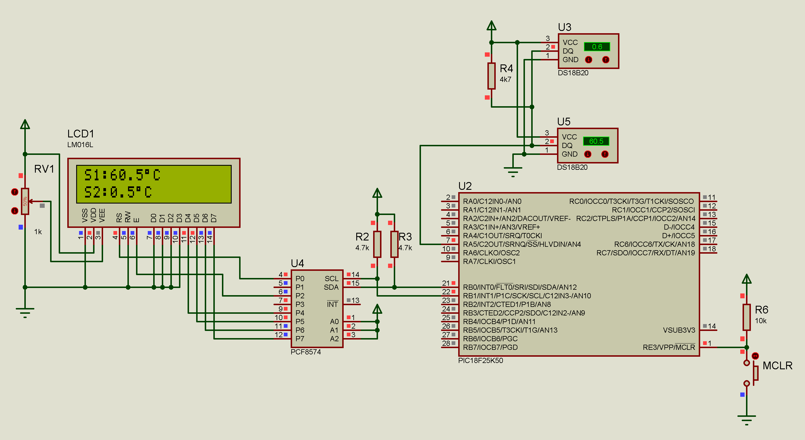

# Dual DS18B20 com PIC18F25K50

Este projeto implementa a leitura de dois sensores de temperatura DS18B20 utilizando o microcontrolador PIC18F25K50. Os sensores compartilham o mesmo barramento OneWire e as temperaturas são exibidas em um display LCD I2C.



## 🚀 Características

- Leitura simultânea de dois sensores DS18B20
- Protocolo OneWire em um único pino
- Display LCD I2C para visualização
- Resolução configurável (9-12 bits)
- Detecção automática de sensores
- Tratamento de erros para sensores ausentes

## 📋 Pré-requisitos

### Software
- mikroC PRO for PIC v7.6 (edição, compilação e debug do código fonte)
- Proteus v8.16 (para simulação)

### Hardware necessário:
- PIC18F25K50
- 2x Sensores DS18B20
- Display LCD I2C 16x2
- Resistor pull-up 4.7kΩ
- Fonte de alimentação 5V

## 🔧 Conexões

### Pinagem do PIC18F25K50:
- RA0 (OneWire) -> DQ
- RB0 (SDA) -> SDA LCD
- RB1 (SCL) -> SCL LCD
- VDD -> 5V
- VSS -> GND

### DS18B20
- DQ (Dados) -> RA5
- VDD -> 5V
- GND -> GND
- Resistor pull-up 4.7kΩ entre DQ e VDD

### LCD I2C
- SDA -> RB0
- SCL -> RB1
- VDD -> 5V
- GND -> GND

## 📁 Estrutura do Projeto

```
DS18B20-With-PIC18F25K50/
├── src/
│   ├── main.c
│   ├── DS18B20_With_PIC18F25K50.hex
│   ├── DS18B20_With_PIC18F25K50.cfg
│   ├── DS18B20_With_PIC18F25K50.mcppi
│   └── bibis/
│       ├── lcd_i2c.c
│       ├── lcd_i2c.h
│       ├── ds18b20.c
│       └── ds18b20.h
├── img/
│   └── circuit.png
├── simulation/
│   └── DS18B20_With_PIC18F25K50.pdsprj
├── doc/
│   ├── manual_mikroC-v101.pdf
│   ├── datasheet_ds18b20.dpf
│   └── datasheet_pic18f25k50.pdf
├── .gitignore.md
├── license.md
└── readme.md
```

## 🛠️ Compilação e Simulação

1. Clone o repositório:
```bash
git clone https://github.com/genlicos/DS18B20-With-PIC18F25K50.git
```

2. Abra o arquivo `src/DS18B20_With_PIC18F25K50.mcppi` no mikroC PRO for PIC v7.6

3. Compile o projeto:
   - Faça as devidas modificações de sua preferência
   - Build o projeto (Ctrl+F9)
   - Firmware gerado `src/DS18B20_With_PIC18F25K50.hex`

4. Para simulação:
   - Abra o arquivo `simulation/DS18B20_With_PIC18F25K50.pdsprj` no Proteus
   - Execute a simulação

## 📄 Configuração Inicial

O código já vem com uma configuração inicial de data e hora que pode ser modificada alterando os valores no arquivo `src/DS18B20_With_PIC18F25K50.c`:

A resolução dos sensores pode ser configurada através da constante `RESOLUCAO`  alterando os valores no arquivo `src/ds18b20.h`::

```c
#define RESOLUCAO 12  // 12 bits (0.0625°C)  - 750ms
#define RESOLUCAO 11  // 11 bits (0.125°C)   - 375ms
#define RESOLUCAO 10  // 10 bits (0.25°C)    - 188ms
#define RESOLUCAO 9   //  9 bits (0.5°C)     - 94ms
```

## ⚡ Características Técnicas

1. **Comunicação I2C**
   - Velocidade de comunicação: 100kHz
   - Pull-up resistor: 4.7kΩ
   - Endereço do LCD: 0x4E

2. **Display LCD**
   - Interface I2C
   - 2 linhas x 16 caracteres
   - Atualização: 1 segundo

3. **DS18B20**
   - Tensão de operação de 3.0v a 5.0v
   - Mede temperaturas entre -55°C a +125°C. Equivalente em Fahrenheit -67°F a +257°F
   - Resolução do termômetro programável de 9 até 12 bits
   - Alarme programável para condições de temperaturas limites
   - Possibilidade de ajuste de até 4 frequências de ondas distintas de saída 

## 🌡️ Funcionamento

1. Na inicialização:
   - Procura sensores no barramento
   - Se não encontrar nenhum: mostra erro e trava
   - Se encontrar apenas 1: mostra aviso e continua
   - Configura resolução dos sensores encontrados

2. Em operação:
   - Lê temperaturas a cada 1 segundo
   - Mostra no LCD:
     - Linha 1: Temperatura sensor 1
     - Linha 2: Temperatura sensor 2
   - Sensores não encontrados mostram 0.0°C

## 🤝 Contribuindo

1. Faça um Fork do projeto
2. Crie uma Branch para sua modificação (`git checkout -b feature/AmazingFeature`)
3. Commit suas mudanças (`git commit -m 'Add some AmazingFeature'`)
4. Push para a Branch (`git push origin feature/AmazingFeature`)
5. Abra um Pull Request

## 📝 Licença

Este projeto está sob a licença MIT - veja o arquivo [LICENSE](license) para detalhes

## ✒️ Autor

* **Elison Nogueira** - *Trabalho Inicial* - [genlicos](https://github.com/genlicos)

## 🎁 Expressões de gratidão

* Compartilhe este projeto 📢
* Me Convide para uma cerveja 🍺 
* Um agradecimento publicamente 🤝
